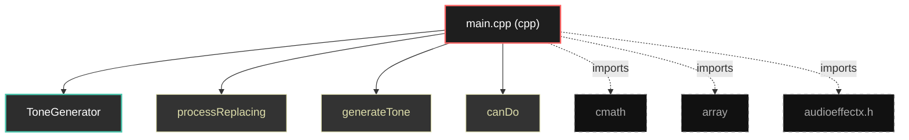

# Polyglot Codebase Knowledge Graph

> Generated offline by **readmenator**. Supports C, C++, Python, Go, Rust, JS/TS, Java, C#, Shell, PHP, Dart, GDScript, Nim, ASM.
> No LLMs. No tokens. Pure static analysis.

**Total Files Parsed:** 1 | **Total Symbols Extracted:** 4 | **Total Imports:** 3

## Structural Knowledge Map

---

## Architecture Reference

### CPP (1 files)

#### `main.cpp`
**Path:** `main.cpp`

**Classs:**
- `ToneGenerator` (line 5) - *include <cmath> include <array> include "public.sdk/source/vst2.x/audioeffectx.h"*

**Functions:**
- `processReplacing` (line 20)
- `generateTone` (line 33)
- `canDo` (line 39)
