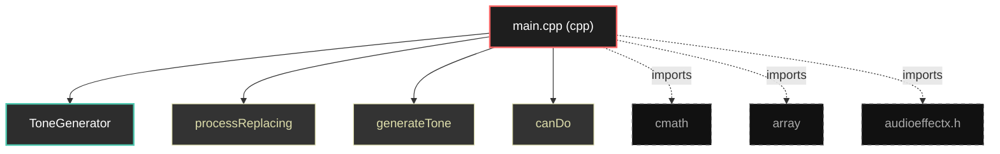
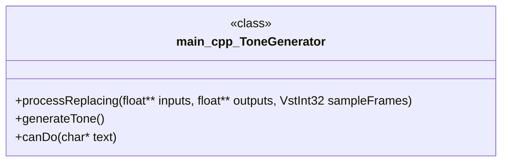

# Polyglot Codebase Knowledge Graph

> Generated offline by **readmenator**. Supports C, C++, Python, Go, Rust, JS/TS, Java, C#, Shell, PHP, Dart, GDScript, Nim, ASM, Ruby, Swift, Kotlin, Scala, Lua, Elixir.
> No LLMs. No tokens. Pure static analysis. See more [here](https://github.com/grisuno/ReadMenator)

**Total Files Parsed:** 1 | **Total Symbols Extracted:** 4 | **Total Imports:** 3

<!-- ranking_model: v1.0 | weights: {ppr:0.45,auth:0.2,test:0.15,doc:0.1,fresh:0.1} | alpha:0.85 | commit:4c8e0d2 | date:2026-07-18 -->


## Table of Contents

1. [Statistics Dashboard](#statistics-dashboard)
2. [Architectural Layers](#architectural-layers)
3. [Ranked Context](#ranked-context)
4. [God Nodes](#god-nodes)
5. [Suggested Questions](#suggested-questions)
6. [Hotspot Analysis](#hotspot-analysis)
7. [Change Impact Analysis](#change-impact-analysis)
8. [Suggested Linting Rules](#suggested-linting-rules)
9. [Query Recipes](#query-recipes)
10. [Structural Knowledge Map](#structural-knowledge-map)
11. [UML Class Diagram](#uml-class-diagram)
12. [Code Property Graph](#code-property-graph)
13. [Architecture Reference](#architecture-reference)
    - [CPP (1 files)](#cpp-1-files)

---

## Statistics Dashboard

| Metric | Value |
|--------|-------|
| Total Files | 1 |
| Total Symbols | 4 |
| Total Imports | 3 |
| Call Edges | 0 |
| Inheritance Edges | 0 |
| Languages | 1 |
| Avg Symbols/File | 4.0 |
| Avg Imports/File | 3.0 |

### Top Files by Import Count (Fan-Out)

| File | Imports | Symbols | Language |
|------|---------|---------|----------|
| `main.cpp` | 3 | 4 | cpp |

---

## Architectural Layers

Auto-detected from path patterns, naming conventions, and imported frameworks.

| Layer | Files |
|-------|-------|
| utility | 1 |

### utility

- `main.cpp` (cpp, 4 symbols)

---

## Ranked Context

Files ranked by composite score for the current query context. The ranking combines Personalized PageRank (query relevance), global authority, test coverage, documentation coverage, and code freshness. Model: v1.0.

| Rank | File | Composite | PPR | Authority | Test | Doc |
|------|------|-----------|-----|-----------|------|-----|
| 1 | `main.cpp` | 0.0250 | 0.0000 | 0.0000 | 0.00 | 0.25 |

---

## God Nodes

Most architecturally central files ranked by combined import/export degree and symbol richness.

| File | Score | Connections | PageRank |
|------|-------|-------------|----------|
| `main.cpp` | 0.4 | | 0.0000 |

---

## Suggested Questions

Auto-generated exploration prompts based on graph structure:

- What does main.cpp depend on, and what depends on it? (0 connections)
- What is ToneGenerator in main.cpp and how is it used?
- What is the overall architecture of this codebase?

---

## Hotspot Analysis

Files ranked by combined complexity (symbol count) and centrality (connection count). High-scoring files are architecturally critical and may need refactoring attention.

| File | Complexity | Centrality | Combined | Symbols | Connections |
|------|-----------|------------|----------|---------|-------------|
| `main.cpp` | 1.000 | 1.000 | 1.000 | 4 | 3 |

---

## Change Impact Analysis

Files sorted by how many other files would be affected if they changed. High-impact files should be changed with caution.

| File | Direct Dependents | Transitive Dependents | Total Impact |
|------|------------------|----------------------|--------------|
| `main.cpp` | 0 | 0 | 0 |

---

## Suggested Linting Rules

Automatically suggested linting and security rules based on patterns detected in the codebase. These can be exported as Semgrep rules using the `--export-rules` flag.

| Rule ID | Severity | Description | Language | Matches |
|---------|----------|-------------|----------|---------|
| `RM001` | info | Large number of functions in cpp: 3 total | cpp | 3 |

---

## Query Recipes

Example queries you can run against this knowledge base using the ranking engine:

```
# Find files most relevant to a concept
readmenator query "Where is the import resolver implemented?"

# Rank files by relevance to a topic
readmenator query "How does documentation generation work?"

# Explain why a file ranks highly
readmenator query "explain readmenator/_documentation.py"

# Trace dependency paths with ranked context
readmenator query "path from CLI to exporter"
```

The ranking model uses the following signals:

- **Personalized PageRank** (45% weight): query-specific relevance via seed propagation
- **Global Authority** (20% weight): structural importance via standard PageRank
- **Test Coverage** (15% weight): fraction of symbols referenced in test files
- **Doc Coverage** (10% weight): presence of docstrings and file-level docs
- **Freshness** (10% weight): recent modification activity

Results include score decomposition and justification paths for each ranked item.

---

## Structural Knowledge Map



---

## UML Class Diagram

Auto-generated Mermaid class diagram from parsed class-level symbols. Shows classes, structs, interfaces, traits, and their methods with inheritance and dependency relationships.



---

## Code Property Graph

Machine-readable Code Property Graph (CPG) in JSON-LD format. This block allows AI agents to parse the full structural graph without additional file reads. Compatible with GraphRAG pipelines.

```json
{"@context": "https://schema.org", "analysis": {"communities": [], "god_nodes": [{"node_id": "main.cpp", "score": 0.4}], "surprising_connections": []}, "edges": [{"confidence": "EXTRACTED", "relation": "imports", "source": "main.cpp", "target": "cmath"}, {"confidence": "EXTRACTED", "relation": "imports", "source": "main.cpp", "target": "array"}, {"confidence": "EXTRACTED", "relation": "imports", "source": "main.cpp", "target": "public.sdk/source/vst2.x/audioeffectx.h"}], "generator": "readmenator", "metadata": {"edge_count": 3, "file_count": 1, "language_count": 1, "symbol_count": 4}, "nodes": [{"doc": "include <cmath> include <array> include \"public.sdk/source/vst2.x/audioeffectx.h\"", "id": "main.cpp", "kind": "module", "label": "main.cpp", "language": "cpp", "sha256": "b80d18bbbfc7bb24", "symbol_count": 4, "symbols": [{"kind": "class", "line": 5, "name": "ToneGenerator"}, {"kind": "function", "line": 20, "name": "processReplacing", "signature": "virtual void processReplacing(float** inputs, float** outputs, VstInt32 sampleFrames)"}, {"kind": "function", "line": 33, "name": "generateTone", "signature": "float generateTone()"}, {"kind": "function", "line": 39, "name": "canDo", "signature": "virtual VstInt32 canDo(char* text)"}]}], "type": "CodePropertyGraph", "version": "1.0"}
```

---

## Architecture Reference

### CPP (1 files)

#### `main.cpp`
**Path:** `main.cpp`
**File Doc:** *include <cmath> include <array> include "public.sdk/source/vst2.x/audioeffectx.h"*

**Classes:**
- `ToneGenerator` (line 5)

**Functions:**
- `processReplacing` (line 20) `virtual void processReplacing(float** inputs, float** outputs, VstInt32 sampleFrames)`
- `generateTone` (line 33) `float generateTone()`
- `canDo` (line 39) `virtual VstInt32 canDo(char* text)`
